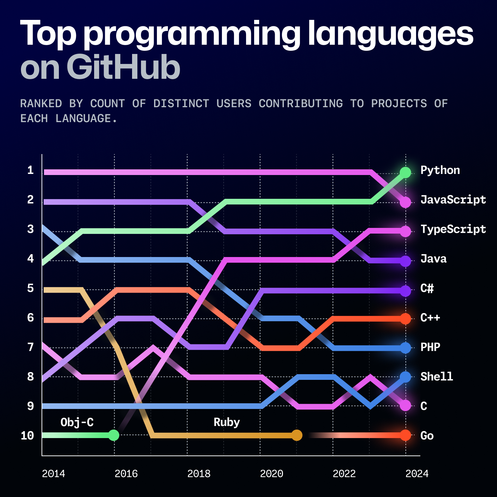

# Learn Modern AI Python

This repo is part of the [Certified Cloud Native Applied Generative AI Engineer](https://docs.google.com/document/d/15usu1hkrrRLRjcq_3nCTT-0ljEcgiC44iSdvdqrCprk/edit?usp=sharing) program. It covers the first quarter of the course work:

### AI-101: Modern AI Python Programming - Your Launchpad into Intelligent Systems

AI-101 is your comprehensive gateway to Python programming for Artificial Intelligence. This course is laser-focused on equipping you with **Modern Python skills**, emphasizing **static typing**, the cornerstone of robust and scalable AI development.  Uniquely, you will also learn to **harness the power of AI to write Python code**, accelerating your learning and development process. From foundational concepts to advanced techniques and practical web application development, AI-101 provides everything you need to excel in AI-driven projects and beyond.

**Key Learning Modules:**
*   **Module 1: Python Fundamentals & Modern Typing:**  Establish a strong foundation in Python syntax, data structures (lists, dictionaries, sets, tuples), control flow, and functions.  Critically, we introduce **Python's type hinting system**, emphasizing its importance for code clarity, error prevention, and maintainability, especially in complex AI projects.

*   **Module 2: Object-Oriented Programming (OOP) in Python for AI:** Master the principles of OOP (classes, objects, inheritance, polymorphism, encapsulation) and understand how to apply them effectively in AI development. Learn to structure complex AI systems using object-oriented design for modularity and reusability.

*   **Module 3: Advanced Python Concepts: Asynchronous Programming & Performance:**  Dive into advanced Python features like asynchronous programming (`asyncio`) for building efficient and concurrent applications, crucial for handling large datasets and complex AI workloads. Explore performance optimization techniques and understand the role of Python's Global Interpreter Lock (GIL) and upcoming solutions like "No GIL" for enhanced concurrency.

*   **Module 4:  AI-Assisted Python Programming:**  Leverage the power of AI tools to enhance your Python coding skills. This module will introduce you to techniques and tools that utilize AI to generate code snippets, debug programs, refactor code, and improve your overall Python development workflow.  Learn to work *with* AI to become a more efficient Python programmer.

*   **Module 5:  Web Application Basics with Python (UV, Streamlit, Next.js & GitHub):**  Gain practical experience in building basic web applications using Python. We will explore lightweight web frameworks and tools including UV for environment management, Streamlit for rapid UI creation, and introduce the concepts behind modern frontend frameworks like Next.js to understand the full stack. You'll also learn essential version control using GitHub for collaborative development and project management.  (Note: *Initially listed UV, VSCode, Streamlit, GitHub - corrected to include Next.js context and clarified UV's role*).

*   **Module 6:  Future of Python & Python in AI:**  Explore the evolving landscape of Python, including upcoming features and performance improvements.  Discuss the continued dominance of Python in the AI field and its application in cutting-edge AI domains like Machine Learning, Deep Learning, and Agentic AI.

**Course Outcomes:**

Upon successful completion of this course, students will be able to:

*   Write proficient Modern Python code utilizing static typing for robust and maintainable AI applications.
*   Apply Object-Oriented Programming principles effectively in Python for structuring complex AI systems.
*   Implement asynchronous programming in Python for building high-performance AI applications.
*   Utilize AI-powered tools and techniques to enhance their Python coding efficiency and quality.
*   Develop basic Python web applications using modern tools and understand fundamental web development concepts.
*   Articulate the future directions of Python and its continued crucial role in the field of Artificial Intelligence.

### Class Videos

[Watch Class Video Playlist by Hamza and Najam](https://www.youtube.com/playlist?list=PL0vKVrkG4hWonNrHafPb2ZD-VnlzVUwmA)

[Watch Class Video Playlist by Qasim](https://www.youtube.com/playlist?list=PL0vKVrkG4hWrEujmnC7v2mSiaXMV_Tfu0)

## We will be using Google Colab for development:

Google Colab is a free, cloud-based Jupyter Notebook service developed by Google. It enables users to write and execute Python code through a web browser, offering seamless integration with Google Drive for easy storage and sharing of notebooks. Colab is particularly beneficial for tasks in machine learning, data analysis, and education, as it provides access to powerful computing resources, including GPUs and TPUs, without requiring any local setup. 

**Key Features of Google Colab:**

- **No Setup Required:** Users can start coding immediately without the need to install any software or manage local environments. 

- **Free Access to Computing Resources:** Colab offers free access to computing resources, including GPUs and TPUs, facilitating the execution of complex computations and machine learning models. 

- **Collaboration:** Notebooks can be easily shared and collaboratively edited, similar to Google Docs, enhancing teamwork and knowledge sharing. 

- **Integration with Google Drive:** Notebooks are stored in Google Drive, allowing for straightforward organization and access across devices. 

- **Support for Various Libraries:** Colab supports popular Python libraries such as TensorFlow, Keras, and NumPy, making it versatile for various data science and machine learning projects. 

**Recent Developments:**

Recently, Google expanded Colab's AI-powered code assistance features to all users in eligible locales, including those on free plans. These features assist in generating code from natural language prompts and provide a code-assisting chatbot to enhance programming efficiency and comprehension. 

**Getting Started with Google Colab:**

To begin using Google Colab:

1. **Access Colab:** Navigate to the [Google Colab website](https://colab.research.google.com/).

2. **Create a New Notebook:** Click on "File" > "New Notebook" to create a new Jupyter Notebook.

3. **Write and Execute Code:** Enter your Python code in the code cells and execute them to see the results.

4. **Save and Share:** Your notebooks are automatically saved in your Google Drive, and you can share them with others by clicking the "Share" button.

For more detailed information and tutorials, refer to the [Colaboratory Frequently Asked Questions](https://research.google.com/colaboratory/faq.html) and the [Colab Help Center](https://support.google.com/colab/).

Google Colab is a valuable tool for both beginners and professionals in data science and machine learning, offering an accessible platform to develop and share projects efficiently. 
